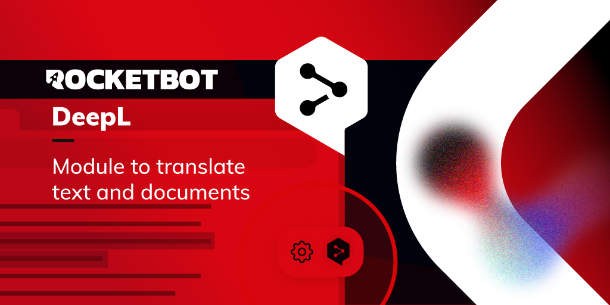

# DeepL
  
Traduce palabras, textos y archivos completos mediante la API de DeepL  

*Read this in other languages: [English](Manual_DeepL.md), [Português](Manual_DeepL.pr.md), [Español](Manual_DeepL.es.md)*
  

## Como instalar este módulo
  
Para instalar el módulo en Rocketbot Studio, se puede hacer de dos formas:
1. Manual: __Descargar__ el archivo .zip y descomprimirlo en la carpeta modules. El nombre de la carpeta debe ser el mismo al del módulo y dentro debe tener los siguientes archivos y carpetas: \__init__.py, package.json, docs, example y libs. Si tiene abierta la aplicación, refresca el navegador para poder utilizar el nuevo modulo.
2. Automática: Al ingresar a Rocketbot Studio sobre el margen derecho encontrara la sección de **Addons**, seleccionar **Install Mods**, buscar el modulo deseado y presionar install.  

## Como usar este modulo
Para utilizar este módulo, debe tener una cuenta DeepL con una suscripción API.

## Descripción de los comandos

### Traducir
  
Traduce texto o un archivo de texto, HTML o XML y almacena la respuesta en una variable.
|Parámetros|Descripción|ejemplo|
| --- | --- | --- |
|Auth Key|Clave de autenticación de cuenta para acceder a la API|279a2e9d-83b3-c416-7e2d-f721593e42a0:fx|
|Tipo de cuenta|Plan de cuenta API REST|Seleccionar|
|Texto|Texto a traducir.||
|Ruta archivo XML/HTML (opcional)|Ruta del archivo XML/HTML a traducir.||
|Idioma objetivo|Idioma al cual traducir.|Seleccionar|
|Dividir frases (opcional)|Criterio para dividir frases.|Seleccionar|
|Preservar formato (opcional)|Respeta el formato original o deja que el motor corrija algunos aspectos Puntuación al principio y al final de la frase; Mayúsculas/minúsculas al comienzo de la oración.||
|Formalidad (opcional)|Establece si el texto traducido debe inclinarse hacia un lenguaje formal o informal.||
|Etiquetas a manejar (opcional)|Por defecto, el motor de traducción no tiene en cuenta las etiquetas XML/HTML. Al configurar el parámetro, la API procesará la entrada extrayendo texto de la estructura, dividiéndolo en oraciones individuales, traduciéndolas y colocándolas nuevamente en la estructura.|Seleccionar|
|Detección automatica de estructura (opcional)|Usar detección automática de la estructura del motor.||
|Etiquetas que no dividen (opcional)|Las etiquetas especificadas no se consideran como separadores de texto.|['p'] > HTML ['document','content'] > XML|
|Etiquetas que no dividen (opcional)|Las etiquetas especificadas se consideran separadores de texto.|['tr', 'div'] > HTML ['title','pal'] > XML|
|Etiquetas a ignorar (opcional)|Las etiquetas especificadas seran ignoran en la traducción.|['a'] > HTML ['meta'] > XML|
|Asignar resultado a variable|Variable donde se almacenara el resultado.|traduccion|

### Traducir documento
  
Traducir archivos docx, pptx, pdf, htm/html, txt o xlf/xliff.
|Parámetros|Descripción|ejemplo|
| --- | --- | --- |
|Auth Key|Clave de autenticación de cuenta para acceder a la API.|279a2e9d-83b3-c416-7e2d-f721593e42a0:fx|
|Tipo de cuenta|Plan de cuenta API REST.|Seleccionar|
|Ruta del archivo|Ruta del archivo a traducir.||
|Ruta guardado|Ruta donde se guardará el archivo traducido.||
|Idioma objetivo|Idioma al cual traducir.|Seleccionar|
|Asignar resultado a variable|Variable donde se almacenara el resultado.|traduccion|
