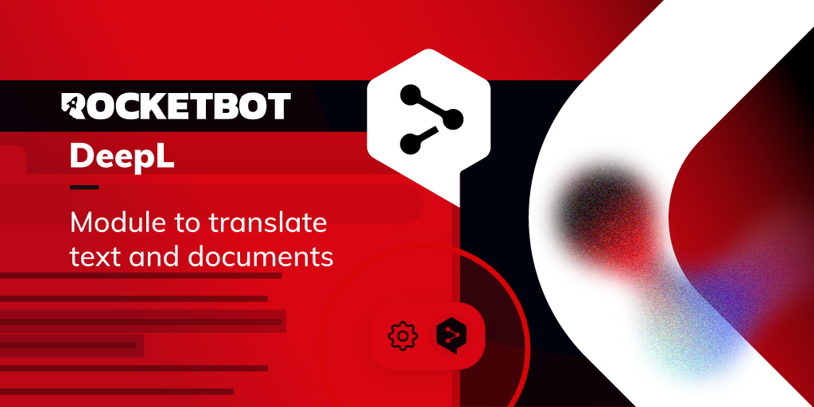

# DeepL
  
Traduza palavras, textos e arquivos inteiros usando a API DeepL  

*Read this in other languages: [English](Manual_DeepL.md), [Português](Manual_DeepL.pr.md), [Español](Manual_DeepL.es.md)*
  

## Como instalar este módulo
  
Para instalar o módulo no Rocketbot Studio, pode ser feito de duas formas:
1. Manual: __Baixe__ o arquivo .zip e descompacte-o na pasta módulos. O nome da pasta deve ser o mesmo do módulo e dentro dela devem ter os seguintes arquivos e pastas: \__init__.py, package.json, docs, example e libs. Se você tiver o aplicativo aberto, atualize seu navegador para poder usar o novo módulo.
2. Automático: Ao entrar no Rocketbot Studio na margem direita você encontrará a seção **Addons**, selecione **Install Mods**, procure o módulo desejado e aperte instalar.  

## Como usar este módulo
Para usar este módulo, você deve ter uma conta DeepL com assinatura de API.

## Descrição do comando

### Traduzir
  
Traduz texto ou arquivo de texto, HTML ou XML e armazena a resposta em uma variável.
|Parâmetros|Descrição|exemplo|
| --- | --- | --- |
|Auth Key|Chave de autenticação da conta para acessar a API|279a2e9d-83b3-c416-7e2d-f721593e42a0:fx|
|Tipo de conta|Plano de conta da API REST|Selecionar|
|Texto|Texto para traduzir.||
|Caminho do arquivo XML/HTML (opcional)|Caminho do arquivo XML/HTML para traduzir.||
|Idioma alvo|Idioma para traduzir.|Selecionar|
|Dividir frases (opcional)|Critério para divisão de sentenças.|Selecionar|
|Preservar formatação (opcional)|Respeita o formato original ou deixa o motor corrigir alguns aspectos Pontuação no início e no final da frase; Maiúsculas/minúsculas no início da frase.||
|Formalidade (opcional)|Define se o texto traduzido deve tender para uma linguagem formal ou informal.||
|Rótulos para lidar (opcional)|Por padrão, o mecanismo de tradução não leva em consideração tags XML/HTML. Ao definir o parâmetro, a API processará a entrada extraindo o texto da estrutura, dividindo-o em frases individuais, traduzindo-as e colocando-as de volta na estrutura.|Selecionar|
|Detecção automática de estrutura (opcional)|Use a detecção automática da estrutura pelo motor.||
|Tags sem divisão (opcional)|As tags especificadas não são consideradas separadores de texto.|['p'] > HTML ['document','content'] > XML|
|Tags sem divisão (opcional)|As tags especificadas são consideradas separadores de texto.|['tr', 'div'] > HTML ['title','pal'] > XML|
|Tags para ignorar (opcional)|As tags especificadas serão ignoradas na tradução.|['a'] > HTML ['meta'] > XML|
|Atribuir resultado a variável|Variável onde o resultado será armazenado.|tradução|

### Traduzir documento
  
Traduz arquivos docx, pptx, pdf, htm/html, txt ou xlf/xliff.
|Parâmetros|Descrição|exemplo|
| --- | --- | --- |
|Auth Key|Chave de autenticação da conta para acessar a API.|279a2e9d-83b3-c416-7e2d-f721593e42a0:fx|
|Tipo de conta|Plano de conta da API REST.|Selecionar|
|Caminho do arquivo|Caminho do arquivo a ser traduzido.||
|Salvar caminho|Caminho onde o arquivo traduzido será salvo.||
|Idioma alvo|Idioma para traduzir.|Selecionar|
|Atribuir resultado a variável|Variável onde o resultado será armazenado.|tradução|
